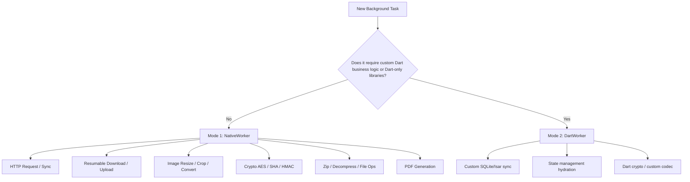

# Architecture & Best Practices Guide: High-Performance Background Execution in Flutter

> **Author:** BrewKits Engineering  
> **Target Audience:** Principal Architects, Tech Leads, and Senior Flutter Developers building commercial-grade, battery-efficient, and memory-resilient mobile applications.

---

## 1. Executive Summary & Philosophy: "Own the Memory"

Background processing on mobile operating systems (Android & iOS) is governed by strict, unforgiving memory and battery policies. 

### The Fatal Flaw of Legacy Flutter Background Plugins
Traditional plugins (such as legacy `workmanager` or `flutter_background_service`) execute background tasks by spinning up a **headless Flutter Engine** for every single operation.
* **RAM Footprint:** A single headless engine consumes **~50–80 MB of RAM**.
* **Startup Latency:** Engine initialization takes **1,500–3,000 ms**.
* **The Fatal Outcome:** When the host app is killed or suspended, OS memory managers (Low Memory Killer / LMK on Android, Jetsam on iOS) aggressively terminate background processes with high RAM usage. On aggressive OEM Android skins (Samsung OneUI, Xiaomi MIUI/HyperOS, Oppo ColorOS), headless Flutter engines are killed before they even finish booting.

```
┌──────────────────────────────────────────────────────────────────┐
│ Engine-per-task Architecture                                     │
│ Background Task ➔ [Boot Flutter Engine] ➔ [Dart VM] ➔ [Execute]  │
│                     └─► ⚠️ A heavy process for the OOM killer    │
└──────────────────────────────────────────────────────────────────┘

┌──────────────────────────────────────────────────────────────────┐
│ native_workmanager Zero-Engine Architecture (Mode 1)             │
│ Background Task ➔ [Native Kotlin Coroutine / Swift Async]        │
│                     └─► No engine started, so none to kill       │
└──────────────────────────────────────────────────────────────────┘
```

### The `native_workmanager` Paradigm
`native_workmanager` solves this by introducing a **Dual Execution Architecture**:
1. **Mode 1 (Native Workers - Recommended):** Runs in pure Kotlin (Android WorkManager) and Swift (`BGTaskScheduler`). No Flutter engine and no Dart isolate is started, so the task carries none of that memory or startup cost — and there is no engine process for the OOM killer to target. (Figures for how much that saves are not published yet; see §5.2.)
2. **Mode 2 (Dart Workers):** Boots a headless Flutter isolate on demand with engine pooling for complex Dart-only business logic.

---

## 2. Dual-Mode Decision Tree

Use this decision matrix when designing your background workloads:



| Workload Type | Recommended Mode | Rationale |
| :--- | :---: | :--- |
| **HTTP Sync / REST API Poll** | `NativeWorker.httpRequest` | Pure native OkHttp / URLSession — zero engine overhead, sub-50ms execution. |
| **Media Download / Upload** | `NativeWorker.httpDownload` / `httpUpload` | Automatic pause/resume, ETag validation, MediaStore & Scoped Storage integration. |
| **Photo / Video Pre-processing** | `NativeWorker.imageProcess` | Native Android `Bitmap` & iOS `CoreGraphics`/`vImage` — zero-copy memory scaling. |
| **Encrypted File Vault** | `NativeWorker.cryptoEncrypt` / `cryptoHash` | Native Android KeyStore & iOS Keychain hardware acceleration. |
| **Complex Dart Calculations** | `DartWorker` | Uses `@WorkerCallback` code generation with isolate reuse and auto-disposal. |

---

## 3. Battle-Tested Production Patterns

### Pattern 1: Resilient Media Pipelines (Linear Chains & DAG Graphs)

Avoid monolithic background tasks. Break multi-step operations into modular, isolated steps using `beginWith` (Fluent Task Chain) or `TaskGraph` (DAG).

#### A. Linear Task Chain with Dynamic Output Piping
If step 2 fails, only step 2 retries. Output data from previous steps is automatically piped using `{{taskId.key}}`:

```dart
await NativeWorkManager
    .beginWith(TaskRequest(
      id: 'download_raw',
      worker: NativeWorker.httpDownload(
        url: 'https://cdn.example.com/raw_photo.jpg',
        savePath: '/tmp/raw_photo.jpg',
      ),
      constraints: const Constraints(requiresNetwork: true),
    ))
    .then(TaskRequest(
      id: 'compress_photo',
      worker: NativeWorker.imageProcess(
        inputPath: '{{download_raw.filePath}}', // Piped from step 1
        outputPath: '/tmp/optimized.jpg',
        maxWidth: 1080,
        quality: 85,
      ),
    ))
    .then(TaskRequest(
      id: 'upload_cloud',
      worker: NativeWorker.httpUpload(
        url: 'https://api.example.com/v1/photos',
        filePath: '{{compress_photo.outputPath}}', // Piped from step 2
      ),
      constraints: const Constraints(requiresNetwork: true),
    ))
    .named('photo_processing_pipeline')
    .enqueue();
```

#### B. Directed Acyclic Graph (DAG) for Parallel Processing
When steps can run concurrently before merging:

```dart
final graph = TaskGraph(id: 'multi_part_export')
  ..add(TaskNode(
    id: 'part_a',
    worker: NativeWorker.httpDownload(url: 'https://cdn.com/a.bin', savePath: '/tmp/a.bin'),
  ))
  ..add(TaskNode(
    id: 'part_b',
    worker: NativeWorker.httpDownload(url: 'https://cdn.com/b.bin', savePath: '/tmp/b.bin'),
  ))
  ..add(TaskNode(
    id: 'merge_and_upload',
    worker: NativeWorker.httpUpload(url: 'https://api.com/submit', filePath: '/tmp/a.bin'),
    dependsOn: ['part_a', 'part_b'], // Runs only after both A and B complete
  ));

await NativeWorkManager.enqueueGraph(graph);
```

---

### Pattern 2: Surviving Process Death & App Kill

#### Android: Implementing `Configuration.Provider`
On Android, WorkManager creates background workers in a fresh process when the app is killed. To guarantee custom workers and Dart callbacks resolve correctly:

1. In your `android/app/src/main/kotlin/.../MainApplication.kt`:
```kotlin
import android.app.Application
import androidx.work.Configuration
import dev.brewkits.native_workmanager.NativeWorkManagerInitializer

class MainApplication : Application(), Configuration.Provider {
    override val workManagerConfiguration: Configuration
        get() = Configuration.Builder()
            .setMinimumLoggingLevel(android.util.Log.INFO)
            .build()
}
```

2. Register your `MainApplication` in `android/app/src/main/AndroidManifest.xml`:
```xml
<application
    android:name=".MainApplication"
    android:icon="@mipmap/ic_launcher"
    android:label="my_app">
```

#### iOS: Background Task Watchdog & Info.plist
Run the automated configuration tool:
```bash
dart run native_workmanager:setup_ios
```
This automatically configures `BGTaskSchedulerPermittedIdentifiers` and `UIBackgroundModes` (`fetch`, `processing`) in `ios/Runner/Info.plist`. `native_workmanager` automatically registers termination handlers to prevent iOS watchdog `0xbaadca11` crashes.

---

### Pattern 3: Zero-Downtime Token Expiry & Automatic Refresh

Long background uploads or periodic syncs often fail with `401 Unauthorized` when JWT tokens expire. `native_workmanager` handles token refreshing completely inside the native worker without waking Dart:

```dart
final worker = NativeWorker.httpUpload(
  url: 'https://api.example.com/v2/secure-upload',
  filePath: '/storage/video.mp4',
  headers: {'Authorization': 'Bearer $currentAccessToken'},
  tokenRefresh: const TokenRefreshConfig(
    url: 'https://api.example.com/oauth/refresh',
    method: 'POST',
    body: {'refresh_token': 'rt_secret_token_123'},
    responseKey: 'data.new_access_token',
    tokenHeaderName: 'Authorization',
    tokenPrefix: 'Bearer ',
  ),
);
```
*If a 401 is encountered, the worker pauses, calls the refresh endpoint, updates the Authorization header, and resumes the upload seamlessly.*

---

### Pattern 4: iOS Live Activity & Dynamic Island Native Bridge (v1.5.0+)

Observe background progress in real time directly from your Flutter UI or native iOS WidgetKit:

#### Flutter side:
```dart
NativeWorkManager.iosLiveActivity
    .onProgress(taskId: 'download_heavy_asset')
    .listen((progress) {
  print('Download Progress: ${progress.progress}% (${progress.networkSpeedHuman})');
});
```

#### Native iOS WidgetKit side:
```swift
import KMPWorkManager
import ActivityKit

// In your Live Activity Widget Extension:
IosLiveActivityBridge.companion.shared.startObserving(taskId: "download_heavy_asset") { progress in
    let currentPct = progress.progress
    // Update Dynamic Island / Lock Screen Live Activity content
}
```

---

### Pattern 5: Offline-First Queue with Exponential Backoff

For reliable analytics dispatch or offline event uploading:

```dart
final uploadQueue = OfflineQueue(
  id: 'analytics_queue',
  maxSize: 500,
  defaultRetryPolicy: const OfflineRetryPolicy(
    maxRetries: 5,
    requiresNetwork: true,
    backoffMultiplier: 2.0,
    initialDelay: Duration(seconds: 30),
    maxDelay: Duration(hours: 6),
  ),
);

// Safe to enqueue anywhere, even with zero network connectivity:
await uploadQueue.enqueue(QueueEntry(
  taskId: 'event_${DateTime.now().millisecondsSinceEpoch}',
  worker: NativeWorker.httpRequest(
    url: 'https://telemetry.example.com/events',
    method: HttpMethod.post,
    body: '{"event": "checkout_completed"}',
  ),
));

// Start queue processing on app launch:
uploadQueue.start();
```

---

## 4. Security & Defensive Hardening

1. **Path Traversal & ZipSlip Protection:**
   Never accept unsanitized file paths from remote payloads. `native_workmanager` automatically enforces canonical path resolution (`validateFilePathSafe`) and rejects relative path escaping (`../`).
2. **SSRF (Server-Side Request Forgery) Prevention:**
   Set `blockPrivateIPs: true` during `NativeWorkManager.initialize()` to prevent background workers from making requests to local network / loopback interfaces (e.g. `127.0.0.1`, `192.168.x`, `10.x`, `169.254.169.254`).
3. **Hardware Keystore Vault for Passwords:**
   Never pass raw encryption passwords in plain JSON configs. Use `KeystorePasswordVault` / `KeychainVault` keys to resolve secrets directly in hardware memory.

---

## 5. Architectural Comparison Matrix

### 5.1 Capabilities

Feature presence, checked against each package's public API. Verify any row yourself from
the linked source before relying on it — capabilities move, and this table is a snapshot.

*Last checked: 2026-09-06.*

| Capability | `native_workmanager` | `workmanager` | `flutter_downloader` | `background_fetch` | `flutter_background_service` |
| :--- | :---: | :---: | :---: | :---: | :---: |
| **Runs a task without booting a Flutter engine** | ✅ Yes (Mode 1) | ❌ No | ⚠️ Download only | ❌ No | ❌ No |
| **Task Graph (DAG) & Pipelines** | ✅ Built-in | ❌ No | ❌ No | ❌ No | ❌ No |
| **Resumable HTTP + ETag Sidecar** | ✅ Built-in | ❌ No | ⚠️ Basic | ❌ No | ❌ No |
| **Automatic 401 Token Refresh** | ✅ Built-in | ❌ No | ❌ No | ❌ No | ❌ No |
| **iOS Live Activity progress filter** | ✅ Built-in (v1.5.0) | ❌ No | ❌ No | ❌ No | ❌ No |
| **DevTools Real-Time Extension** | ✅ Built-in | ❌ No | ❌ No | ❌ No | ❌ No |
| **Type-Safe Code Generator** | ✅ `native_workmanager_gen` | ❌ No | ❌ No | ❌ No | ❌ No |
| **Battery-restriction diagnostics** | ✅ Built-in (v1.7.0) | ❌ No | ❌ No | ❌ No | ❌ No |

### 5.2 Performance — not yet published

This section previously carried a RAM figure, a startup-latency figure, and a
"100% Guaranteed" survival claim, for this package *and* for four others. **Those numbers
have been removed because none of them were measured by a run anyone could reproduce.**

That was the wrong thing to ship, for two reasons:

1. **"100% Guaranteed" cannot be true.** Nothing guarantees background execution on Android
   or iOS. The OS can defer, the OEM can kill, the user can force-stop. A library that
   claims a guarantee is either not measuring or not telling you what it measured. What
   this package actually does is persist through official WorkManager/SQLite and
   BGTaskScheduler storage so a task is *restored* after process death — which is a
   meaningful property, and a different claim.
2. **Competitor numbers were asserted, not run.** Publishing an unmeasured figure for
   someone else's package is worse than publishing none.

`benchmark/README.md` states the standard this project holds itself to: a performance claim
is credible only when the methodology is transparent, anyone can reproduce it, and the
community can verify it independently. The harness exists
(`example/integration_test/firebase_benchmark_test.dart` plus
`scripts/firebase-benchmark.sh`), so the standard is reachable — it just has not been run
across a published device matrix yet.

Until it has, this table stays empty rather than carrying numbers that would not survive
being checked. Results are published under `benchmark/results/` with the device, OS build,
and date attached.

The first recorded run —
[`benchmark/results/2026-09-06-ios-simulator/`](../benchmark/results/2026-09-06-ios-simulator/README.md)
— is a simulator run, and it is the clearest argument for having removed the old numbers:
against a published claim of `< 50 ms` task startup, the project's own harness reports
**698 ms** and **794 ms**. It also shows the Dart-worker path reporting *faster* than the
native path, which is almost certainly a measurement artefact — and therefore something to
audit before any figure from this harness is published as a result.

If you need a figure today, run the harness on your own hardware — that answer is worth
more than a table entry anyway:

```bash
flutter test example/integration_test/firebase_benchmark_test.dart \
  --timeout=none -d <your-device-id>
```

---

## 6. Summary Checklist for Release

- [x] Run `await NativeWorkManager.initialize()` before `runApp()`.
- [x] Run `dart run native_workmanager:setup_ios` to configure `Info.plist`.
- [x] On Android, add `Configuration.Provider` on your `Application` class if scheduling tasks after app kill.
- [x] Use Mode 1 (`NativeWorker`) for all standard network, file, image, and crypto tasks.
- [x] Use Mode 2 (`DartWorker` + `@WorkerCallback`) when complex Dart state or plugins are required.
- [x] Monitor background tasks using DevTools Extension or `ObservabilityConfig`.
